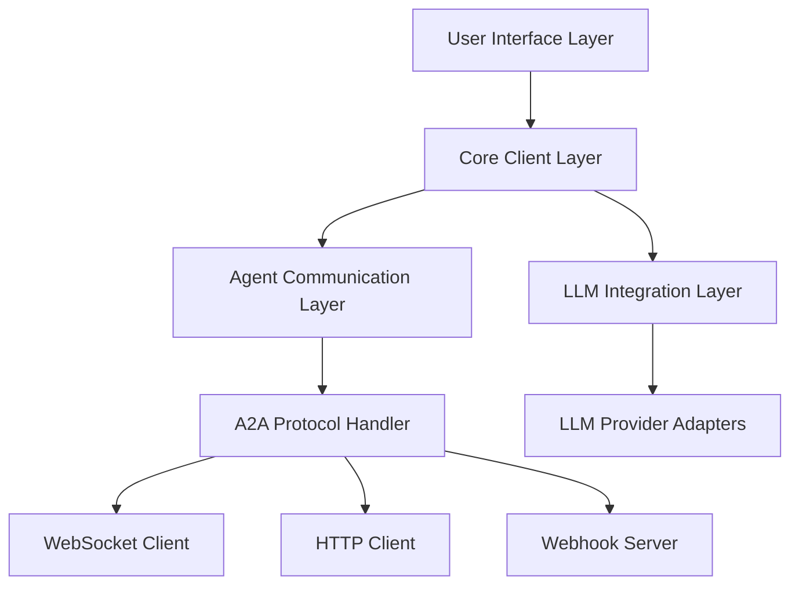

# A2A Client with Base LLM Integration
## Documentation

---

## Table of Contents

1. [Introduction](#introduction)
2. [System Architecture](#system-architecture)
3. [A2A Protocol Implementation](#a2a-protocol-implementation)
4. [Multi-Agent Support](#multi-agent-support)
5. [Base LLM Integration](#base-llm-integration)
6. [User Interface Design](#user-interface-design)
7. [Implementation Plan](#implementation-plan)
8. [Technical Specifications](#technical-specifications)
9. [Security Considerations](#security-considerations)
10. [Future Enhancements](#future-enhancements)

---

## Introduction

### Overview

The A2A Client is a Python-based application designed to interact with A2A (Agent-to-Agent) protocol-compliant agents while also providing direct access to various Large Language Models (LLMs). This client serves as a bridge between users and AI agents, allowing seamless communication with specialized agents like the Interview Preparation Agent, as well as direct interaction with base LLMs for general queries.

### Purpose

The primary purpose of this client is to provide a unified interface for:
- Communicating with A2A protocol-compliant agents
- Interacting directly with various LLM providers
- Switching between agent and LLM modes based on user needs
- Managing conversation contexts and history

### Key Features

- **A2A Protocol Support**: Full implementation of the A2A protocol including streaming responses and push notifications
- **Multi-Agent Support**: Ability to interact with multiple agents and switch between them
- **Base LLM Integration**: Direct access to multiple LLM providers (OpenAI, Google Gemini, Anthropic, etc.)
- **Minimal UI**: Clean, intuitive interface focused on the chat experience
- **Hybrid Agent Discovery**: Built-in default agents plus ability to add custom agents

---

## System Architecture

### High-Level Architecture



### Component Breakdown

#### User Interface Layer
- **Chat Interface**: Simple chat UI with message history
- **Agent Selector**: Dropdown/menu to select which agent to use
- **Settings Panel**: Configuration for API keys and agent endpoints
- **Response Renderer**: Handles rendering of different response types

#### Core Client Layer
- **Session Manager**: Manages user sessions and authentication
- **Context Manager**: Maintains conversation context and history
- **Message Router**: Routes messages to appropriate agent or LLM
- **Configuration Store**: Stores user preferences and API keys

#### Agent Communication Layer
- **Agent Registry**: Stores information about available agents
- **Agent Discovery Service**: Discovers and registers new agents
- **Agent Capability Analyzer**: Determines agent capabilities

#### A2A Protocol Handler
- **Request Builder**: Constructs A2A protocol requests
- **Response Parser**: Parses A2A protocol responses
- **Task Tracker**: Tracks status of ongoing tasks
- **Webhook Handler**: Processes incoming webhook notifications

#### LLM Integration Layer
- **LLM Router**: Routes requests to appropriate LLM provider
- **Provider Registry**: Manages available LLM providers
- **Response Formatter**: Formats LLM responses for UI display

### Technology Stack

- **Programming Language**: Python 3.9+
- **UI Framework**: PyQt6 or Tkinter
- **HTTP Client**: httpx for async HTTP requests
- **WebSocket**: websockets library
- **Webhook Server**: FastAPI with uvicorn
- **Database**: SQLite for local storage
- **Configuration**: JSON files and environment variables

---

## A2A Protocol Implementation

### Protocol Overview

The A2A protocol is a JSON-RPC 2.0 based protocol for communication between clients and AI agents. It supports:
- Synchronous and asynchronous communication
- Streaming responses
- Push notifications via webhooks
- Task tracking and management

### Request Format

```json
{
  "jsonrpc": "2.0",
  "method": "agent/message",
  "params": {
    "message": {
      "content": "User message",
      "contentType": "text/plain"
    },
    "contextId": "unique-context-id",
    "configuration": {
      "pushNotificationConfig": {
        "url": "http://localhost:8000/webhook",
        "authentication": {
          "schemes": ["Bearer"]
        }
      }
    }
  },
  "id": "request-id"
}
```

### Response Format

```json
{
  "jsonrpc": "2.0",
  "result": {
    "task": {
      "id": "task-id",
      "contextId": "context-id",
      "status": {
        "state": "working",
        "message": {
          "content": "Agent response",
          "contentType": "text/plain"
        }
      }
    }
  },
  "id": "request-id"
}
```

### Task States

- **working**: Agent is processing the request
- **input_required**: Agent needs more input from the user
- **completed**: Agent has completed the task
- **submitted**: Task has been submitted for async processing

### Webhook Notifications

For asynchronous processing, the client provides a webhook URL where the agent can send push notifications:

```json
{
  "jsonrpc": "2.0",
  "method": "pushNotifications/send",
  "params": {
    "task": {
      "id": "task-id",
      "contextId": "context-id",
      "status": {
        "state": "completed",
        "message": {
          "content": "Task completed response",
          "contentType": "text/plain"
        }
      }
    }
  },
  "id": "notification-id"
}
```

### Implementation Classes

```python
class A2AClient:
    """Main A2A protocol client implementation."""
    
    def __init__(self, http_client: httpx.AsyncClient):
        self.http_client = http_client
    
    async def send_message(self, agent_url: str, message: str, context_id: str, 
                          webhook_url: Optional[str] = None, 
                          auth_headers: Optional[Dict[str, str]] = None) -> AsyncGenerator:
        """Send a message to an A2A agent and stream the response."""
        # Implementation details...
```

```python
class WebhookHandler:
    """Handles incoming webhook notifications from agents."""
    
    def __init__(self, port: int = 8000):
        self.app = FastAPI()
        self.port = port
        # Implementation details...
    
    async def start(self):
        """Start the webhook server."""
        # Implementation details...
```

---

## Multi-Agent Support

### Agent Data Model

```python
class AgentCapabilities:
    streaming: bool = False
    push_notifications: bool = False
    file_upload: bool = False
    tool_use: bool = False

class AgentAuthentication:
    auth_type: str  # "api_key", "bearer", "basic", "none"
    api_key_name: Optional[str] = None
    token: Optional[str] = None

class Agent:
    id: str
    name: str
    description: str
    url: str
    capabilities: AgentCapabilities
    authentication: AgentAuthentication
    default_input_modes: List[str]
    default_output_modes: List[str]
    skills: List[Dict[str, Any]]
    is_default: bool = False
    is_built_in: bool = True
```

### Agent Registry

The Agent Registry manages the collection of available agents:

```python
class AgentRegistry:
    def __init__(self, config_path: str = "config/agents.json"):
        self.config_path = config_path
        self.agents = {}
        self.load_agents()
    
    def load_agents(self):
        """Load agents from configuration file."""
        # Implementation details...
    
    def add_agent(self, agent: Agent):
        """Add or update an agent in the registry."""
        # Implementation details...
    
    def get_agent(self, agent_id: str) -> Optional[Agent]:
        """Get an agent by ID."""
        # Implementation details...
```

### Agent Discovery

The Agent Discovery service fetches agent capabilities from endpoints:

```python
class AgentDiscovery:
    def __init__(self, registry: AgentRegistry):
        self.registry = registry
        self.http_client = httpx.AsyncClient()
    
    async def discover_agent(self, url: str, auth: Optional[Dict[str, str]] = None) -> Optional[Agent]:
        """Discover an agent by fetching its agent card."""
        # Implementation details...
```

### Agent Communication Manager

Handles communication with agents:

```python
class AgentCommunicationManager:
    def __init__(self, registry: AgentRegistry):
        self.registry = registry
        self.http_client = httpx.AsyncClient()
        self.active_tasks = {}  # Map of task_id to task info
    
    async def send_message(self, agent_id: str, message: str, context_id: Optional[str] = None) -> AsyncGenerator:
        """Send a message to an agent and stream the response."""
        # Implementation details...
```

### Context Management

Manages conversation contexts:

```python
class ContextManager:
    def __init__(self, db_path: str = "data/contexts.db"):
        self.db_path = db_path
        self._ensure_db()
    
    def create_context(self, agent_id: str) -> str:
        """Create a new context for an agent."""
        # Implementation details...
    
    def add_message(self, context_id: str, role: str, content: str):
        """Add a message to a context."""
        # Implementation details...
```

---

## Base LLM Integration

### LLM Provider Interface

```python
class LLMProvider(ABC):
    """Abstract base class for LLM providers."""
    
    @abstractmethod
    async def generate(self, prompt: str, **kwargs) -> AsyncGenerator[str, None]:
        """Generate text from the LLM, streaming the response."""
        pass
    
    @abstractmethod
    async def generate_complete(self, prompt: str, **kwargs) -> str:
        """Generate text from the LLM, returning the complete response."""
        pass
    
    @property
    @abstractmethod
    def available_models(self) -> List[str]:
        """Get a list of available models for this provider."""
        pass
```

### Provider Implementations

#### OpenAI Provider

```python
class OpenAIProvider(LLMProvider):
    """OpenAI API provider implementation."""
    
    def __init__(self, api_key: Optional[str] = None):
        self.api_key = api_key or os.getenv("OPENAI_API_KEY")
        self.client = None
        if self.api_key:
            import openai
            self.client = openai.AsyncClient(api_key=self.api_key)
    
    async def generate(self, prompt: str, **kwargs) -> AsyncGenerator[str, None]:
        """Generate text from OpenAI, streaming the response."""
        # Implementation details...
```

#### Google Gemini Provider

```python
class GeminiProvider(LLMProvider):
    """Google Gemini API provider implementation."""
    
    def __init__(self, api_key: Optional[str] = None):
        self.api_key = api_key or os.getenv("GOOGLE_API_KEY")
        self.client = None
        if self.api_key:
            import google.generativeai as genai
            genai.configure(api_key=self.api_key)
            self.client = genai
    
    async def generate(self, prompt: str, **kwargs) -> AsyncGenerator[str, None]:
        """Generate text from Gemini, streaming the response."""
        # Implementation details...
```

#### Anthropic Provider

```python
class AnthropicProvider(LLMProvider):
    """Anthropic Claude API provider implementation."""
    
    def __init__(self, api_key: Optional[str] = None):
        self.api_key = api_key or os.getenv("ANTHROPIC_API_KEY")
        self.client = None
        if self.api_key:
            import anthropic
            self.client = anthropic.Anthropic(api_key=self.api_key)
    
    async def generate(self, prompt: str, **kwargs) -> AsyncGenerator[str, None]:
        """Generate text from Claude, streaming the response."""
        # Implementation details...
```

### LLM Router

```python
class LLMRouter:
    """Routes requests to the appropriate LLM provider."""
    
    def __init__(self):
        self.providers = {}
        self.default_provider = None
    
    def register_provider(self, provider: LLMProvider, is_default: bool = False):
        """Register an LLM provider."""
        # Implementation details...
    
    async def generate(self, prompt: str, provider_name: Optional[str] = None, **kwargs) -> AsyncGenerator[str, None]:
        """Generate text using the specified provider."""
        # Implementation details...
```

### LLM Configuration Manager

```python
class LLMConfigManager:
    """Manages LLM provider configurations."""
    
    def __init__(self, config_path: str = "config/llm_config.json"):
        self.config_path = config_path
        self.config = self._load_config()
    
    def get_provider_config(self, provider_name: str) -> Dict[str, Any]:
        """Get configuration for a specific provider."""
        # Implementation details...
    
    def set_api_key(self, provider_name: str, api_key: str):
        """Set API key for a provider."""
        # Implementation details...
```

### LLM Chat History Manager

```python
class LLMChatHistoryManager:
    """Manages chat history for LLM conversations."""
    
    def __init__(self, db_path: str = "data/llm_chats.db"):
        self.db_path = db_path
        self._ensure_db()
    
    def create_chat(self, provider_name: str, title: Optional[str] = None) -> str:
        """Create a new chat session."""
        # Implementation details...
    
    def add_message(self, chat_id: str, role: str, content: str):
        """Add a message to a chat."""
        # Implementation details...
```

---

## User Interface Design

### Main Application Window

```
+--------------------------------------------------------------+
|  A2A Client                                      [_] [□] [X]  |
+--------------------------------------------------------------+
| Agent: [Interview Prep Agent ▼]        [Settings] [Connect]   |
+--------------------------------------------------------------+
|                                                              |
|  +--------------------------------------------------------+  |
|  |                                                        |  |
|  |  Agent: How can I help you today?                      |  |
|  |                                                        |  |
|  |  User: I want to prepare for a software engineering    |  |
|  |        interview.                                      |  |
|  |                                                        |  |
|  |  Agent: Great! I'll help you prepare for interviews.   |  |
|  |         Let me gather some information to create a     |  |
|  |         personalized preparation plan.                 |  |
|  |                                                        |  |
|  |         First, which interview domains would you like  |  |
|  |         to focus on? You can choose multiple:          |  |
|  |                                                        |  |
|  |         🔹 Algorithms - Data structures, algorithms    |  |
|  |         🔹 System Design - Scalable architecture       |  |
|  |         🔹 Databases - SQL, NoSQL, database design     |  |
|  |         🔹 Machine Learning - ML algorithms            |  |
|  |                                                        |  |
|  |                                                        |  |
|  +--------------------------------------------------------+  |
|                                                              |
|  +--------------------------------------------------------+  |
|  | Type your message...                        [Send] [⚙️] |  |
|  +--------------------------------------------------------+  |
|                                                              |
| Status: Connected to Interview Prep Agent                    |
+--------------------------------------------------------------+
```

### Agent Selection Dropdown

```
+--------------------------------------------------------------+
| Agent: [Interview Prep Agent ▼]        [Settings] [Connect]   |
+--------------------------------------------------------------+
|       +--------------------------------+                      |
|       | ✓ Interview Prep Agent         |                      |
|       | ○ Code Assistant Agent         |                      |
|       | ○ Research Agent               |                      |
|       | ○ Base LLM (No Agent)          |                      |
|       |                                |                      |
|       | [+ Add Custom Agent]           |                      |
|       +--------------------------------+                      |
```

### Settings Dialog

```
+--------------------------------------------------------------+
|  Settings                                         [_] [□] [X]  |
+--------------------------------------------------------------+
|                                                              |
|  API Keys                                                    |
|  +--------------------------------------------------------+  |
|  | OpenAI API Key:     [••••••••••••••••••••••••••] [Edit] |  |
|  | Google API Key:     [••••••••••••••••••••••••••] [Edit] |  |
|  | Anthropic API Key:  [                        ] [Edit]    |  |
|  | Custom API Key:     [                        ] [Edit]    |  |
|  +--------------------------------------------------------+  |
|                                                              |
|  Agent Configuration                                         |
|  +--------------------------------------------------------+  |
|  | Default Agent: [Interview Prep Agent ▼]                 |  |
|  | Webhook Port:  [8000                  ]                 |  |
|  | Timeout (sec): [60                    ]                 |  |
|  +--------------------------------------------------------+  |
|                                                              |
|  LLM Settings                                                |
|  +--------------------------------------------------------+  |
|  | Default Provider: [OpenAI ▼]                            |  |
|  | Default Model:    [gpt-3.5-turbo ▼]                     |  |
|  | Temperature:      [0.7          ]                       |  |
|  +--------------------------------------------------------+  |
|                                                              |
|                                        [Cancel] [Save]       |
+--------------------------------------------------------------+
```

### Add Custom Agent Dialog

```
+--------------------------------------------------------------+
|  Add Custom Agent                                 [_] [□] [X]  |
+--------------------------------------------------------------+
|                                                              |
|  Agent Details                                               |
|  +--------------------------------------------------------+  |
|  | Agent Name:        [                              ]     |  |
|  | Agent URL:         [                              ]     |  |
|  | Authentication:    [API Key ▼]                          |  |
|  | API Key:           [                              ]     |  |
|  +--------------------------------------------------------+  |
|                                                              |
|  Agent Capabilities                                          |
|  +--------------------------------------------------------+  |
|  | [✓] Streaming                                           |  |
|  | [✓] Push Notifications                                  |  |
|  | [ ] File Upload                                         |  |
|  | [ ] Tool Use                                            |  |
|  +--------------------------------------------------------+  |
|                                                              |
|                                      [Cancel] [Test] [Add]   |
+--------------------------------------------------------------+
```

### Async Processing Indicator

```
+--------------------------------------------------------------+
|                                                              |
|  +--------------------------------------------------------+  |
|  |                                                        |  |
|  |  User: Yes, create my plan                             |  |
|  |                                                        |  |
|  |  Agent: Processing your interview preparation request...|  |
|  |                                                        |  |
|  |  [🔄 Creating personalized interview plan...]          |  |
|  |                                                        |  |
|  |  Status: Researching latest interview resources        |  |
|  |  Progress: ███████████████████░░░░░ 70%                |  |
|  |                                                        |  |
|  |  This process takes 2-3 minutes. You'll be notified    |  |
|  |  when your plan is ready.                              |  |
|  |                                                        |  |
|  +--------------------------------------------------------+  |
|                                                              |
```

### Agent vs. Base LLM Toggle

```
+--------------------------------------------------------------+
| Mode: [Agent ▼]  Agent: [Interview Prep Agent ▼]  [Settings] |
+--------------------------------------------------------------+
|       +--------------------------------+                      |
|       | ✓ Agent                        |                      |
|       | ○ Base LLM                     |                      |
|       +--------------------------------+                      |
```

---

## Implementation Plan

### Phase 1: Core Infrastructure (Week 1)

1. **Project Setup**
   - Create project structure
   - Set up virtual environment
   - Install dependencies

2. **Configuration Management**
   - Implement settings storage
   - Create agent registry
   - Set up LLM configuration

3. **Basic UI Shell**
   - Create main window
   - Implement basic chat interface
   - Add settings dialog skeleton

### Phase 2: A2A Protocol Support (Week 2)

1. **A2A Client Implementation**
   - Implement JSON-RPC client
   - Add streaming support
   - Create request/response handling

2. **Webhook Handler**
   - Create webhook server
   - Implement push notification processing
   - Add callback registration

3. **Task Tracking**
   - Implement task state management
   - Create context tracking
   - Add message history storage

### Phase 3: LLM Integration (Week 3)

1. **Provider Interfaces**
   - Implement abstract provider class
   - Create OpenAI provider
   - Create Google Gemini provider
   - Create Anthropic provider
   - Add local LLM support (optional)

2. **LLM Router**
   - Implement provider registration
   - Create routing logic
   - Add fallback mechanisms

3. **Chat History**
   - Implement chat storage
   - Create history management
   - Add export/import functionality

### Phase 4: UI Integration (Week 4)

1. **Chat Interface**
   - Enhance message rendering
   - Add streaming visualization
   - Implement progress indicators

2. **Agent/LLM Selection**
   - Create selection UI
   - Implement switching logic
   - Add custom agent UI

3. **Settings Integration**
   - Complete settings dialog
   - Add API key management
   - Implement configuration persistence

### Phase 5: Testing and Refinement (Week 5)

1. **Testing**
   - Test with multiple agents
   - Test with various LLM providers
   - Verify webhook functionality

2. **Bug Fixing**
   - Address identified issues
   - Optimize performance
   - Improve error handling

3. **Documentation**
   - Create user documentation
   - Add code documentation
   - Prepare release notes

---

## Technical Specifications

### File Structure

```
a2a_client/
├── main.py                  # Application entry point
├── config/
│   ├── settings.py          # Configuration settings
│   ├── agents.json          # Agent registry
│   └── llm_config.json      # LLM configuration
├── ui/
│   ├── main_window.py       # Main application window
│   ├── chat_widget.py       # Chat interface
│   ├── agent_selector.py    # Agent selection UI
│   └── settings_dialog.py   # Settings dialog
├── core/
│   ├── session_manager.py   # Session management
│   ├── context_manager.py   # Conversation context
│   ├── message_router.py    # Message routing
│   └── config_store.py      # Configuration storage
├── agents/
│   ├── agent_registry.py    # Agent registration
│   ├── agent_discovery.py   # Agent discovery
│   ├── agent_comm.py        # Agent communication
│   └── webhook_handler.py   # Webhook processing
├── llm/
│   ├── llm_router.py        # LLM routing
│   ├── llm_config.py        # LLM configuration
│   ├── chat_history.py      # Chat history management
│   └── providers/           # LLM provider implementations
│       ├── openai.py
│       ├── gemini.py
│       ├── anthropic.py
│       └── local.py
└── data/                    # Data storage
    ├── contexts.db          # SQLite for contexts
    └── llm_chats.db         # SQLite for LLM chats
```

### Dependencies

```
# Core dependencies
PyQt6>=6.5.0  # or Tkinter (built-in)
httpx>=0.24.0
websockets>=11.0.0
pydantic>=2.0.0
fastapi>=0.100.0
uvicorn>=0.22.0

# LLM provider dependencies
openai>=1.0.0
google-generativeai>=0.3.0
anthropic>=0.5.0

# Utilities
python-dotenv>=1.0.0
```

### Data Storage

#### Agent Registry (JSON)

```json
[
  {
    "id": "interview_prep",
    "name": "Interview Prep Agent",
    "description": "Helps prepare for technical interviews",
    "url": "http://localhost:10001/",
    "capabilities": {
      "streaming": true,
      "push_notifications": true,
      "file_upload": false,
      "tool_use": false
    },
    "authentication": {
      "auth_type": "api_key",
      "api_key_name": "X-API-Key",
      "token": "api-key-value"
    },
    "default_input_modes": ["text/plain"],
    "default_output_modes": ["text/plain"],
    "is_default": true,
    "is_built_in": true
  }
]
```

#### LLM Configuration (JSON)

```json
{
  "default_provider": "OpenAI",
  "providers": {
    "OpenAI": {
      "api_key": "",
      "default_model": "gpt-3.5-turbo",
      "temperature": 0.7,
      "max_tokens": 1000
    },
    "Google Gemini": {
      "api_key": "",
      "default_model": "gemini-1.5-pro",
      "temperature": 0.7
    },
    "Anthropic Claude": {
      "api_key": "",
      "default_model": "claude-3-sonnet-20240229",
      "temperature": 0.7,
      "max_tokens": 1000
    },
    "Local LLM": {
      "host": "http://localhost:11434",
      "default_model": "llama3"
    }
  }
}
```

#### SQLite Database Schemas

**Contexts Database:**
```sql
CREATE TABLE contexts (
    context_id TEXT PRIMARY KEY,
    agent_id TEXT NOT NULL,
    created_at TIMESTAMP DEFAULT CURRENT_TIMESTAMP
);

CREATE TABLE messages (
    id INTEGER PRIMARY KEY AUTOINCREMENT,
    context_id TEXT NOT NULL,
    role TEXT NOT NULL,
    content TEXT NOT NULL,
    timestamp TIMESTAMP DEFAULT CURRENT_TIMESTAMP,
    FOREIGN KEY (context_id) REFERENCES contexts (context_id)
);
```

**LLM Chats Database:**
```sql
CREATE TABLE llm_chats (
    chat_id TEXT PRIMARY KEY,
    provider_name TEXT NOT NULL,
    title TEXT,
    created_at TIMESTAMP DEFAULT CURRENT_TIMESTAMP
);

CREATE TABLE llm_messages (
    id INTEGER PRIMARY KEY AUTOINCREMENT,
    chat_id TEXT NOT NULL,
    role TEXT NOT NULL,
    content TEXT NOT NULL,
    timestamp TIMESTAMP DEFAULT CURRENT_TIMESTAMP,
    FOREIGN KEY (chat_id) REFERENCES llm_chats (chat_id)
);
```

---

## Security Considerations

### API Key Management

- API keys are stored in the configuration file
- Keys are masked in the UI
- Option to use environment variables instead of configuration file
- Encryption of stored keys (optional enhancement)

### Webhook Security

- Validation of incoming webhook requests
- Support for webhook tokens
- Optional HTTPS for production use
- Rate limiting for webhook endpoints

### Data Privacy

- All conversation data stored locally
- No data sent to third parties except API providers
- Option to clear history and cached data
- No logging of sensitive information

---

## Future Enhancements

### Advanced Features

1. **File Upload/Download**
   - Support for file-based interactions with agents
   - Document processing capabilities
   - Image and media handling

2. **Tool Use**
   - Support for agents that use tools
   - Tool execution visualization
   - Tool result handling

3. **Advanced Conversation Management**
   - Conversation branching
   - Alternative response generation
   - Conversation summarization

### Platform Extensions

1. **Web Version**
   - Browser-based client
   - Cloud synchronization
   - Shared agent registry

2. **Mobile Application**
   - Android/iOS versions
   - Push notifications on mobile
   - Touch-optimized interface

3. **API for Integration**
   - REST API for third-party integration
   - Webhook endpoints for external systems
   - SDK for developers

### Performance Optimizations

1. **Caching**
   - Response caching
   - Agent capability caching
   - LLM response caching

2. **Batch Processing**
   - Batch message processing
   - Parallel agent queries
   - Background processing

3. **Offline Capabilities**
   - Offline message queuing
   - Local LLM fallback
   - Sync when online